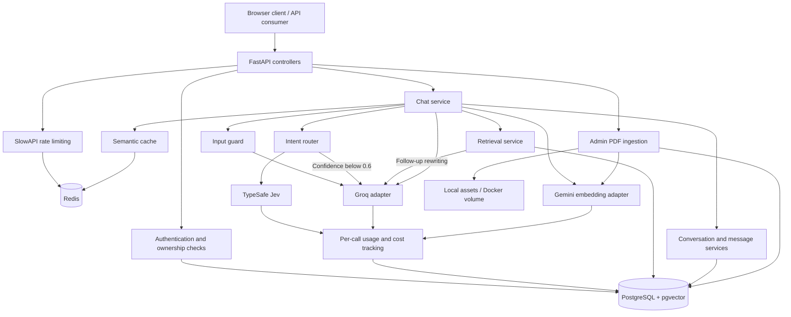
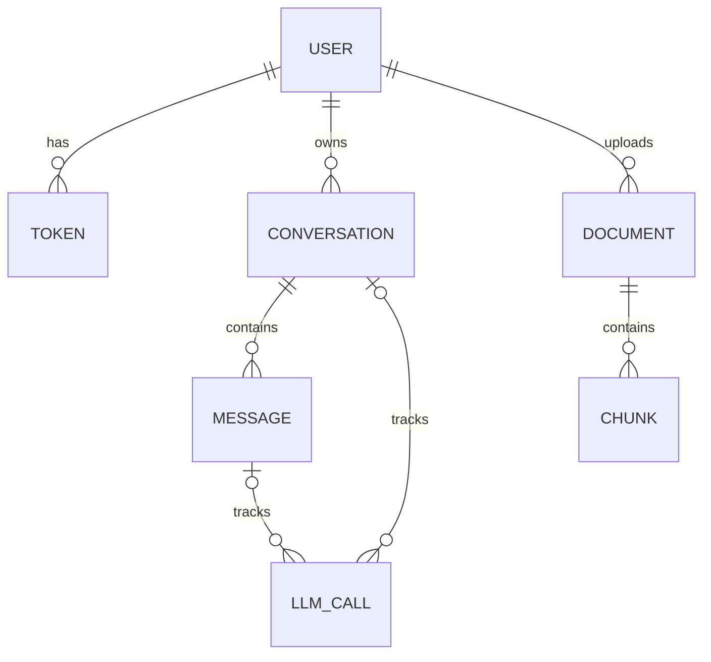

# Company Policy Assistant

A FastAPI application that turns company policy PDFs into a conversational knowledge base. It combines retrieval-augmented generation (RAG), streamed answers, persistent conversations, revocable authentication, Redis-backed rate limiting, and semantic response caching.

The backend uses **Groq for language generation and input guarding**, **TypeSafe Jev for intent classification**, **Gemini for embeddings**, **PostgreSQL with pgvector for retrieval**, and **Redis for caching and request limits**. A browser chat client is included at `/pages/client.html`.

## Engineering highlights

- **Layered architecture:** API controllers, application services, repositories, and provider adapters have separate responsibilities and are wired through FastAPI dependencies.
- **Selective retrieval:** TypeSafe Jev distinguishes policy questions, follow-ups, small talk, and unsupported requests, with a Groq LLM fallback when confidence is below 0.6. A separate guard model checks input before routing.
- **Per-call accounting:** provider calls record token usage, estimated costs, success or failure, and available message/conversation IDs in a dedicated ledger.
- **Context-aware search:** follow-up questions are rewritten into standalone queries before embedding and retrieval.
- **Semantic reuse:** similar policy questions can reuse a cached answer, bypassing vector retrieval and final answer generation.
- **Durable streaming:** partial answers are periodically saved, with explicit pending, streaming, completed, failed, and cancelled states, plus time-to-first-token and total-time measurements.
- **Server-side session revocation:** signed JWTs reference database token records, allowing logout to invalidate a session before its JWT expires.
- **Shared rate-limit storage:** Redis counters allow application instances using the same configuration to share enforcement state.
- **Indexed vector search:** an Alembic migration creates a cosine HNSW index over 768-dimensional policy embeddings.

## Architecture



The diagram shows component relationships; the request sequence is described below.

| Layer | Location | Responsibility |
| --- | --- | --- |
| HTTP interface | `controllers/api/` | Request validation, authentication dependencies, response schemas, and streaming endpoints |
| Application logic | `services/` | Authentication, conversation ownership, routing, memory, message lifecycle, and chat orchestration |
| RAG pipeline | `services/rag/` | PDF ingestion, chunking, query rewriting, and retrieval |
| Persistence | `repositories/`, `entities/` | SQLAlchemy queries, relationships, and database records |
| External integrations | `providers/` | LLM, intent router, embedding, and semantic cache adapters |
| Infrastructure | `infrastructure/`, `config/` | Dependency wiring, async database sessions, rate limits, prompts, and environment settings |
| Delivery and validation | `alembic/`, `docker/`, `tests/` | Schema migrations, container definitions, automated tests, and load-test scenarios |

Database access uses SQLAlchemy's async engine with `asyncpg` and request-scoped sessions. LLM and embedding adapters are lazily reused within each application process. Router adapters are wired through `RouterFactory`; `JavRouter` calls TypeSafe Jev and `LLMRouter` uses a tracked Groq model. `LLMCallService` persists call records through the request's database session.

## How a chat request works

1. Authenticate the bearer token and resolve the conversation. Existing conversations are checked against the current user's ID. A new conversation receives an LLM-generated title.
2. Load history for an existing conversation and check the latest message with `GUARD_MODEL_NAME`. A score above `GUARD_THRESHOLD` (default 0.7) produces a fixed refusal and ends the stream before creating a message record or routing.
3. Create a pending message record. Pass the latest message and up to four history messages to the intent router, with message/conversation IDs for accounting. Jev returns an intent and confidence; confidence below 0.6 triggers the LLM fallback.
4. Select the intent-specific system prompt and derive the follow-up and retrieval flags in application code. For policy follow-ups with history, rewrite the question using up to ten recent history messages.
5. If retrieval is needed, embed the query and check the semantic cache. On a hit, emit the saved answer, record completion and latency, and finish the stream.
6. On a cache miss, retrieve up to five policy chunks by cosine distance. Assemble the route-specific system prompt, retrieved context, conversation history, and latest question. Small talk and unsupported requests skip embedding, cache lookup, and retrieval.
7. Stream the generated answer, periodically save its accumulated text, and record completion and latency. Provider usage is saved separately in `llm_calls`. Cache the answer when the request required retrieval and returned policy chunks.

### Intent routing

| Intent | Meaning | Retrieval |
| --- | --- | --- |
| `small_talk` | Greetings, thanks, acknowledgements, or questions about assistant capabilities | No |
| `policy_question` | A standalone request to identify or explain a company policy | Yes |
| `policy_followup` | A policy request that depends on a previous topic or answer | Yes; rewrite when history is available |
| `unsupported` | Requests outside company policy assistance or actions the assistant cannot perform | No |

Both router adapters return `(ChatIntents, confidence)`. Jev uses a typed `Choice` with the enum values as criteria keys; it returns decisions rather than generated text. The LLM fallback validates its response against `ChatRouter`, containing `route` and `confidence`. `RouterService` returns `(system_prompt, follow_up, needs_retrieval)` to the chat service.

The confidence threshold is currently hard-coded in `services/router.py`. Fallback occurs for low confidence, not automatically for provider exceptions. There is no `blocked` intent: input guarding is a separate step. Classification can still be incorrect, including at high confidence. Policy answer prompts instruct the model to use supplied context and acknowledge missing information.

## Document ingestion and retrieval

Only users with the `ADMIN` role can ingest documents through `POST /file/upload`.


- Uploaded names are reduced to a basename and prefixed with a UUID to reduce path and filename collision risks.
- Files are written incrementally with `aiofiles`; `READ_FILE_CHUNK` controls each read size, not the total permitted upload size.
- `pypdf` parses PDFs in strict mode. This pipeline extracts existing text; it does not perform OCR on scanned pages.
- `RecursiveCharacterTextSplitter` uses configurable character-based chunk size and overlap.
- Document embeddings include the filename as title context; query embeddings include a question-answering prefix.
- Chunks retain their document ID, text, position, optional JSONB metadata, and embedding. A unique constraint prevents duplicate positions within one document.
- Retrieval returns up to five chunks ordered by cosine distance. There is currently no minimum relevance cutoff or reranking stage.

The document corpus is shared across users. `created_by` records the uploader, but retrieval does not filter by uploader or tenant. The current design fits a shared company knowledge base.

## Security and access control

| Control | Implementation |
| --- | --- |
| Password storage | bcrypt hashes through Passlib; plaintext passwords are not persisted |
| Registration validation | Alphanumeric usernames of 3–20 characters; passwords of 8–64 characters requiring lowercase, uppercase, and a digit |
| Access tokens | Signed JWTs, defaulting to HS256 with a 60-minute lifetime |
| Session revocation | JWT `sub` identifies a database token record; protected requests require that record to exist and remain active |
| Logout | Deactivates the current token record |
| Conversation isolation | Conversation listing filters by user; reads, updates, deletion, message listing, and existing chat access check ownership |
| Upload authorization | Ingestion checks the authenticated user's database role |
| Registration role handling | The registration service persists the username and password hash using default user fields rather than honoring submitted role values |
| Output schemas | API response models separate public user fields from stored password hashes |

Authentication and rate-limit identity are separate: the limiter decodes a JWT to choose a counter key, while the authentication service also checks database revocation state.

## Rate limiting

[`infrastructure/rate_limit.py`](infrastructure/rate_limit.py) configures SlowAPI with Redis storage, the `ratelimit` key prefix, and three default windows:

| Window | Limit |
| --- | ---: |
| Burst | 2 requests per 5 seconds |
| Hourly | 60 requests per hour |
| Daily | 200 requests per day |

A successfully decoded bearer JWT uses its user `id` as the key. Requests without a usable JWT fall back to the client IP, or `anonymous` if no client is available. Exceeded limits are handled with HTTP `429` responses.

These are default route limits, not an explicitly configured application-wide quota shared across all endpoints. There are no route-specific overrides or separate token/cost budgets. Redis stores counters outside the API process; no local-memory fallback is configured. Reverse-proxy client IP handling must match the deployment for anonymous limits to identify callers correctly.

## Semantic caching

[`providers/cache/redis_cache.py`](providers/cache/redis_cache.py) wraps RedisVL's `SemanticCache` using the `policy_cache` index and a distance threshold of **0.1**.

| Decision | Behavior and tradeoff |
| --- | --- |
| Match by query embedding | Reuses answers for similar wording, rather than requiring an exact text match |
| Reuse the query vector | The same embedding is passed to cache lookup, retrieval, and cache storage |
| Cache only grounded retrieval responses | Writes occur when retrieval was requested and at least one policy chunk was found; answer correctness is not independently verified |
| Bypass retrieval and answer generation on a hit | Reduces downstream work, although routing, query embedding, optional rewriting, and new-conversation title generation can still call providers |
| Shared namespace | Cache entries are not partitioned by user, conversation, document version, or model |
| No explicit expiration or invalidation | No TTL is configured in this adapter, and document ingestion does not invalidate previous answers |

Cache hits create no final answer-generation call record. Guarding, routing, optional rewriting, query embedding, and new-conversation title generation can still incur costs and retain their own call records. Message records store content, lifecycle status, and latency rather than token/cost totals.

Because generated answers may incorporate conversation history while cache lookup uses only the query vector, shared caching needs additional scoping before serving personalized or tenant-specific policy content. Corpus or model changes also need an invalidation strategy.

## Usage and cost tracking

`services/llm_calls.py` supplies `LLMCallService`, `TrackedLLM`, and `TrackedEmbedding`. `JavRouter` also records its TypeSafe calls through `LLMCallService`. Each `llm_calls` row stores call type, purpose, provider/model, available token counts and estimated costs, success status, error type, and optional message/conversation IDs.

- Routing calls use purpose `intent_router`. Jev records use provider `typesafe` and the model ID returned by the API; they use the existing `generation` call type. A low-confidence Jev decision followed by the LLM fallback produces two call records.
- Routing, rewriting, query embedding, and final answers carry both message and conversation IDs. Title generation and input guarding happen before message creation and carry the conversation ID. Document embedding calls can have neither ID.
- Failures and cancellations are recorded; available usage is retained. Missing usage or costs stay `NULL` rather than being reported as zero. Call records retain the error type, not the upstream error message.
- `config/llm_pricing.json` configures per-million-token input/output rates. The checked-in TypeSafe rate for `jev-1.13.0` is `$0.042` for input and `$0` for output. Decimal arithmetic is used for estimates; these records are not provider invoices. When changing a configured model, add its pricing entry too.
- Migration `e62c91a740bd` moves historical message usage into `legacy_answer` call records and removes message-level token/cost columns. Run migrations before using the current code. Downgrading restores answer usage only; auxiliary call records cannot fit the old schema.

## Streaming, persistence, and recovery

Chat responses use **Server-Sent Events (SSE)** over HTTP POST with `text/event-stream`:

| Event | Payload |
| --- | --- |
| `token` | Answer text; a cache hit can send the complete answer in one event |
| `conversation` | JSON containing `title` and `conversation_id` |
| `done` | `[DONE]` |
| `error` | `Provider failed` for failures caught during routing, retrieval, or answer generation |

The SSE formatter prefixes each line of multiline content with `data:`. Clients should parse named events and use a POST-capable streaming client, as the bundled browser UI does.

Messages move through `PENDING`, `STREAMING`, `COMPLETED`, `FAILED`, and `CANCELLED` states. Accumulated output is saved during streaming at the configured interval (`STREAM_UPDATE_SEC`, default **4 seconds**). Completion persists the answer, time to first token (`ttft`), and total time. Caught failures preserve accumulated text and mark the message failed; cancellation preserves partial content and marks an unfinished message cancelled. Provider usage is recorded separately in the call ledger.

When messages are read, pending or streaming records older than `CUTOFF_SEC` (default **30 seconds**, based on `updated_at`) are marked failed. This is lazy stale-message reconciliation, not a background retry worker or resumable stream. The cutoff is not a provider request timeout. Routing, embedding, and retrieval are inside the stream's error handler; conversation setup and the input guard run before it.

## Data model and design decisions



| Decision | Why it is useful | Current tradeoff |
| --- | --- | --- |
| PostgreSQL for application data and vectors | Keeps relational records and searchable chunks in one database | Vector dimensions and indexes must stay aligned with the embedding model |
| JWT plus database token records | Supports immediate per-session logout | Authenticated requests require database access |
| HTTP streaming | Delivers incremental output through the existing API | No reconnect/replay protocol is implemented |
| Repository-level commits | Makes each saved lifecycle transition durable | Document creation and chunk insertion are separate commits, so ingestion is not fully atomic |
| Provider interfaces and dependency injection | Keeps orchestration testable with replaceable adapters and fakes | Adding a provider still requires an implementation and factory support |
| Full conversation memory | Retains prior context for answer generation | There is no summarization or token-budget trimming for the final answer prompt |
| Alembic-managed schema | Makes database changes explicit and versioned | Migrations must run before serving application traffic |


## API surface

| Method | Route | Purpose | Access |
| --- | --- | --- | --- |
| GET | `/` | Basic liveness response | Public |
| POST | `/auth/register` | Register a user | Public |
| POST | `/auth/login` | Exchange form credentials for a bearer token | Public |
| POST | `/auth/logout` | Revoke the supplied token | Bearer token |
| POST | `/chat/stream_new` | Start a conversation and stream an answer | Authenticated |
| POST | `/chat/stream/{conversation_id}` | Stream within a conversation | Authenticated; ownership checked if found |
| GET, POST | `/conversations/` | List or create conversations | Authenticated |
| GET, PUT, DELETE | `/conversations/{conversation_id}` | Read, update, or delete a conversation | Owner |
| GET | `/conversations/{conversation_id}/messages` | Read message history | Owner |
| GET | `/conversations/{conversation_id}/title` | Retrieve a conversation title | Owner |
| POST | `/file/upload` | Upload and index a PDF | Admin |

An unknown conversation ID passed to the chat stream creates a new conversation; access to another user's existing conversation is rejected. Interactive API documentation is available at `/docs` and `/redoc`.

## Local setup

Use Python **3.12** to match the Docker image, PostgreSQL with the pgvector extension available, and Redis with the search/vector functionality required by RedisVL. The default setup requires Groq, TypeSafe, and Gemini credentials for live chat and ingestion.

From the repository root:

```sh
python -m venv .venv
# Activate: .venv\Scripts\Activate.ps1 on PowerShell
# Activate: source .venv/bin/activate on macOS/Linux
python -m pip install -r requirements.txt
```

Create a root `.env` using this template. Replace credential placeholders and select models supported by your provider accounts. The generation and fallback models must support the JSON-schema requests used for routing, rewriting, and titles. The guard model must return a numeric score. Model identifiers below match the checked-in pricing catalog.

```dotenv
POSTGRES_USER=fastapi
POSTGRES_PASSWORD=replace-with-local-database-password
POSTGRES_DB=fastapi
POSTGRES_HOST=localhost

REDIS_HOST=localhost
REDIS_PASSWORD=replace-with-local-redis-password

PASSWORD_SECRET=replace-with-a-long-random-signing-secret
PASSWORD_ALGORITHM=HS256

MODEL_PROVIDER=groq
MODEL_NAME=openai/gpt-oss-120b
SMALL_MODEL_NAME=openai/gpt-oss-20b
GUARD_MODEL_NAME=meta-llama/llama-prompt-guard-2-22m
GUARD_THRESHOLD=0.7
GROQ_KEY=replace-with-your-groq-key

ROUTER_PROVIDER=jav
ROUTER_PROVIDER_FALLBACK=llm
TYPESAFE_API_KEY=replace-with-your-typesafe-key
TYPESAFE_MODEL=jev-1.13.0

EMBEDDING_PROVIDER=gemini
EMBEDDING_MODEL=gemini-embedding-2
GEMINI_API_KEY=replace-with-your-gemini-key
EMBEDDING_VECTOR_SIZE=768

CHUNK_SIZE=1000
CHUNK_OVERLAP=200
STREAM_UPDATE_SEC=4
CUTOFF_SEC=30
READ_FILE_CHUNK=52428800
```

The chunk size and overlap above are example values; they are required settings with no code defaults. Keep the embedding dimension at **768** unless you also migrate the database vector column and rebuild existing embeddings and cache data.

With PostgreSQL and Redis running:

```sh
alembic upgrade head
uvicorn main:app --reload
```

Open [the chat client](http://localhost:8000/pages/client.html) or [Swagger UI](http://localhost:8000/docs). Register a user, then log in. Login uses form-encoded `username` and `password`; chat requests use JSON such as `{"message":"What is the remote work policy?"}` and an `Authorization: Bearer <access_token>` header.

To populate the knowledge base, provision an admin role in the database and upload a text-based PDF through `/file/upload`. There is no role-management endpoint or admin bootstrap command.

### Docker configuration

[`docker/docker-compose.yml`](docker/docker-compose.yml) defines the API, PostgreSQL/pgvector, Redis, and a one-shot migration service. It includes dependency health checks, a backend network, Redis append-only persistence, and named volumes for uploads and data.

Before using Compose:

- Create the referenced `docker/.env.app`, `docker/.env.postgres`, and `docker/.env.redis` files. Use the application settings above in `.env.app`, with `POSTGRES_HOST=postgres` and `REDIS_HOST=redis`.
- Supply matching `POSTGRES_USER`, `POSTGRES_PASSWORD`, and `POSTGRES_DB` in `.env.postgres`. The PostgreSQL health check currently assumes the username `fastapi`.
- Align Redis's application password, Compose command interpolation, and health-check password. The checked-in health check contains a literal development password; a service `env_file` alone does not supply Compose interpolation values.
- Review the PostgreSQL 18 volume mount against the selected image's data-directory layout before relying on database persistence.
- Exclude secrets and local artifacts from the Docker build context before building: the Dockerfile uses `COPY . .`, and the repository currently has no `.dockerignore`. Keep the Docker environment files out of version control as well.

After configuring those files and settings, start infrastructure, run migrations, and then start the API:

```sh
docker compose -f docker/docker-compose.yml up -d postgres redis
docker compose -f docker/docker-compose.yml run --rm migrate
docker compose -f docker/docker-compose.yml up -d --build fastapi
```

This explicit sequence matters because the API service does not depend on successful completion of the migration service. The supplied Compose file publishes database and Redis ports to the host and should be reviewed before deployment beyond local development.

## Operational scope

The implementation demonstrates the core systems of a persistent RAG application. Remaining deployment work includes cache scoping and invalidation, upload limits and ingestion cleanup, explicit provider timeouts and retries, context budgeting, and deployment-specific secret and network controls.

The root health endpoint reports process liveness only; it does not probe dependencies. SQLAlchemy SQL echo logging is currently enabled. Dedicated readiness checks, structured telemetry, and comprehensive live-infrastructure tests are not implemented.
